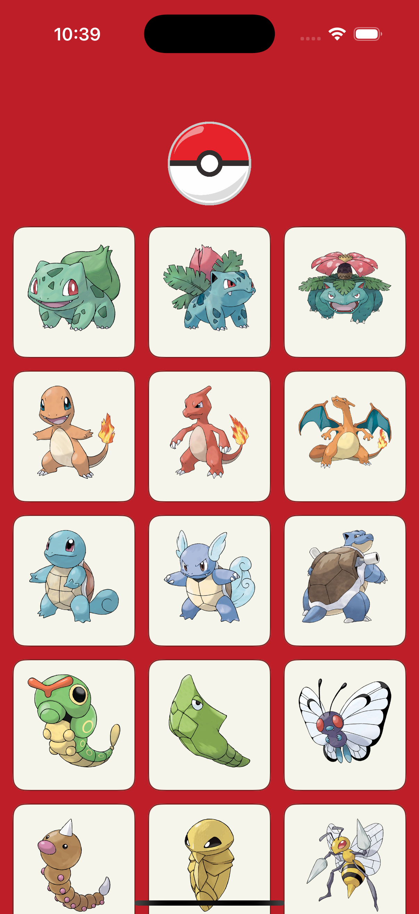
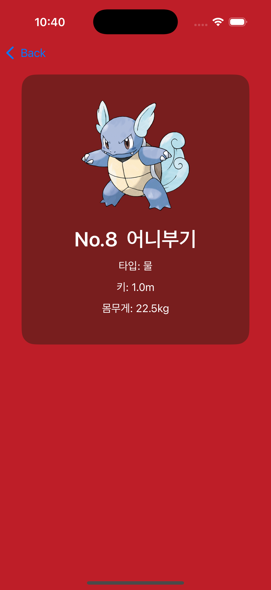

# 포켓몬 도감 앱 (Pokedex)

> MVVM + RxSwift 기반 포켓몬 도감 앱
> 포켓몬 API를 활용하여 포켓몬 리스트 및 상세 정보를 확인할 수 있습니다.

---

## 시연 이미지

|              메인화면              |                디테일화면               |
| :----------------------------: | :--------------------------------: |
|  |  |

---

## 사용 기술

| 기술                  | 설명                                                   |
| ------------------- | ---------------------------------------------------- |
| `UIKit`             | 화면 구성                                                |
| `RxSwift / RxCocoa` | 비동기 처리 및 MVVM 바인딩                                    |
| `SnapKit`           | 코드 기반 AutoLayout                                     |
| `Kingfisher`        | 이미지 비동기 로딩 + 캐싱                                      |
| `pokeapi.co`        | 오픈 API 사용 ([https://pokeapi.co](https://pokeapi.co)) |

---

##  프로젝트 구조

```
PokemonDic/
├── Model/
│   ├── Pokemon.swift
│   ├── PokemonDetail.swift
|   ├── PokemonTranslator.swift(영문이름 한글로 변환)
|   └── PokemonTypeName.swift(영문타입 한글로 변환)
├── ViewModel/
│   ├── MainViewModel.swift
│   └── DetailViewModel.swift
├── View/
│   ├── MainViewController.swift
│   ├── DetailViewController.swift
│   └── Cell/PokemonCell.swift
├── Network/
│   └── NetworkManager.swift(싱글톤 적용)
└── AppDelegate / SceneDelegate / Assets.xcassets (pokemonBall 이미지 등) / Color.swift (mainRed, darkRed 정의)
```

---

##  주요 기능

### 메인 화면 (MainViewController)

* 포켓몬 리스트 20개씩 불러오기 (무한 스크롤)
* `UICollectionView` 활용하여 3열 카드형 UI 구현
* 포켓몬 이름 한글 변환 적용
* Kingfisher로 이미지 로딩 및 캐싱

### 디테일 화면 (DetailViewController)

* 포켓몬 이미지, 번호, 이름, 키, 몸무게, 타입 표시
* 빨간 배경 + 다크레드 카드 형태 UI 적용
* 한글 이름, 타입 변환 (커스텀 enum 및 translator 활용)

### 기타

* RxSwift `Relay` 기반 ViewModel 구성
* MVVM 아키텍처 적용으로 뷰와 로직 분리

---

## 🔗 API 사용 예시

* 포켓몬 리스트:
  `https://pokeapi.co/api/v2/pokemon?limit=20&offset=0`

* 포켓몬 상세 정보:
  `https://pokeapi.co/api/v2/pokemon/{id}`

* 포켓몬 이미지:
  `https://raw.githubusercontent.com/PokeAPI/sprites/master/sprites/pokemon/other/official-artwork/{id}.png`

---

## 향후 개선 방향 (Optional)

* 즐겨찾기 기능 (CoreData / UserDefaults)
* 타입별 필터링 기능
* 검색 기능 추가
* iPad 대응 레이아웃
* 다크모드 대응
